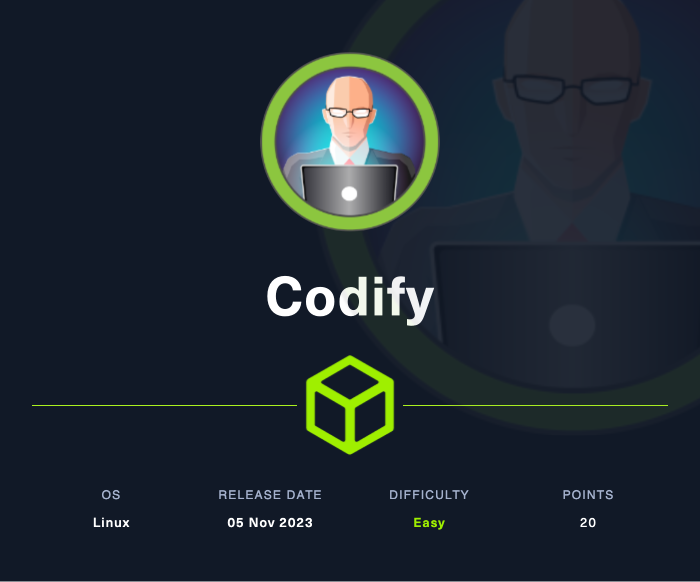
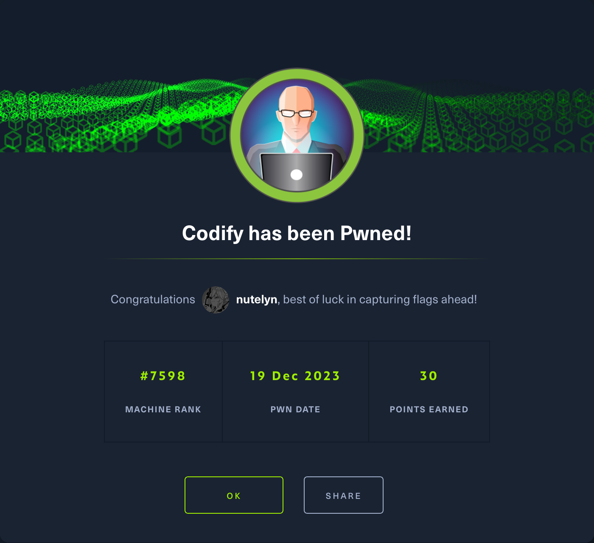

# Initial Reconnaissance
1. `curl -I 10.10.11.239` to find possible location / DNS name
2. get a result of `codify.htb` add these to `/etc/hosts`
3. the webpages doesn't have any particular things to explore, consisting of 3 pages, like limitation, about the backend and a node.js simulator
4. there's a module blacklists of `child_process` and `fs`
5. the backend uses `vm2` to sandbox javascript and looks like it's using the version `3.9.16`
6. the sandbox pretty much runs every JS code i give to it
7. nothing more interesting

# User Escalation
1. earlier i found some blacklist, and the backend which is `vm2 3.9.16` while searching for any known vulnerabilities it turns out that this version affected with these 2 CVE `CVE-2023-30547` and `CVE-2023-29199`. which basically allows me to run arbitrary code into the vm2
2. after a while of searching i found this POC `https://github.com/rvizx/CVE-2023-30547/tree/main`, download the file into my local machine
3. i modified the code to print the payload so i could run it into the vm myself, and then i setup an nc listener to gain a reverse shell `nc -lvnp 9090`
4. then i change the `cmd` part of the payload to a create a file in `/tmp/yourname`, then a file named `rev.sh` with reverse shell content, and run it with `bash rev.sh`
5. notice the on the listener i have gained an access, but its not stable enough so i use python to gain a proper shell `python3 -c "import pty; pty.spawn('/bin/bash')"`
6. on the `/var/www` there's a several interesting directory like `tickets` which has a `tickets.db`, exfiltrate the file to my local machine
7. there's also an `index.js` which when analyzed it turns out that the database is an `sqlite3` database, which then i could open the database with the appropriate tools `sqlite3 tickets.db`
8. i notice that there's 2 tables inside `users`, and `tickets`. users table taken my interest, and i found a credential for `joshua` but the password is hashed, extract the hash to a new file `joshua.hash`, i will try to crack the hash
9. identify the hash `hashid joshua.hash`, returns possible 3 hash `blowfish`, `woltlab`, `bcrypt`. it's mode is 3200 in hashcat, and i will use `rockyou.txt` wordlists
10. crack the hash `hashcat -m 3200 joshua.hash rockyou.txt`, after a while it will return a password `spongebob1`
11. with the known credential of `joshua:spongebob1` i proceed to connect to the machine via SSH
12. `ssh joshua@codify.htb`, enter `yes` if theres a prompt, and input the password
13. `cat user.txt`
14. flag: `e0d21543429e3bd92b2965b2e901b5df`

# Further Reconnaissance
1. `sudo -l` shows that i could run a script named `/opt/script/mysql_backup.sh` as root

# Privilege Escalation
1. analyzing the script it's reading the password from `/root/.creds`
2. notice that the password checking function is actually matching the patter with `if [[ $DB_PASS == $USER_PASS ]];` if i input `*` it will return true, so i create a python script to extract the password
3. running the python script return the password which then be used to logged in as the admin `su root` then enter the password
4. `cat /root/root.txt`
5. flag: `b140eda77eb0e356b3e9d0a2c08ea79d`

