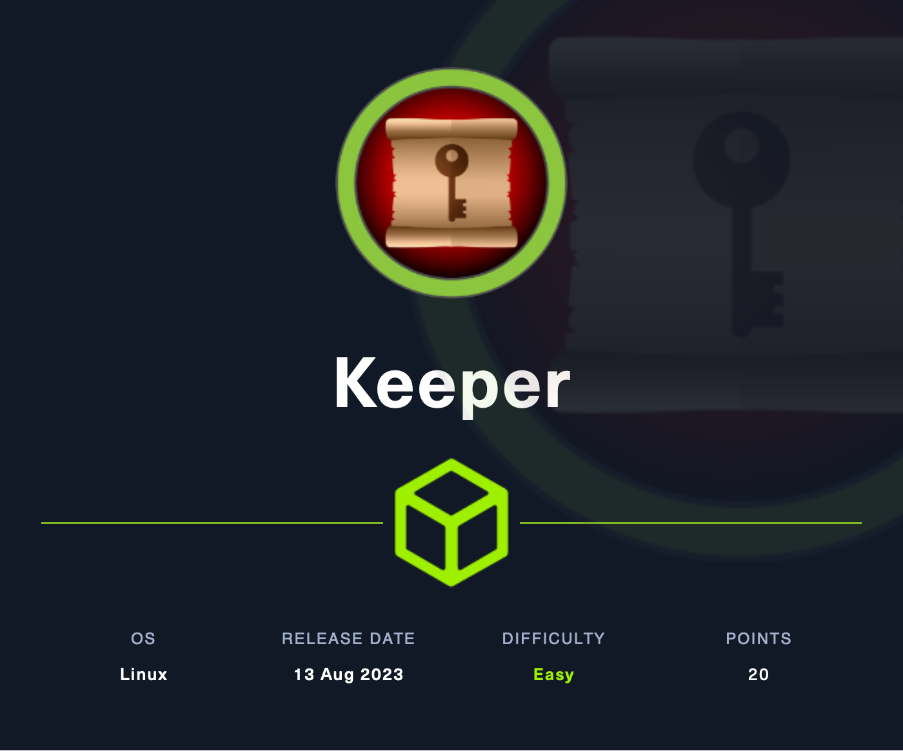
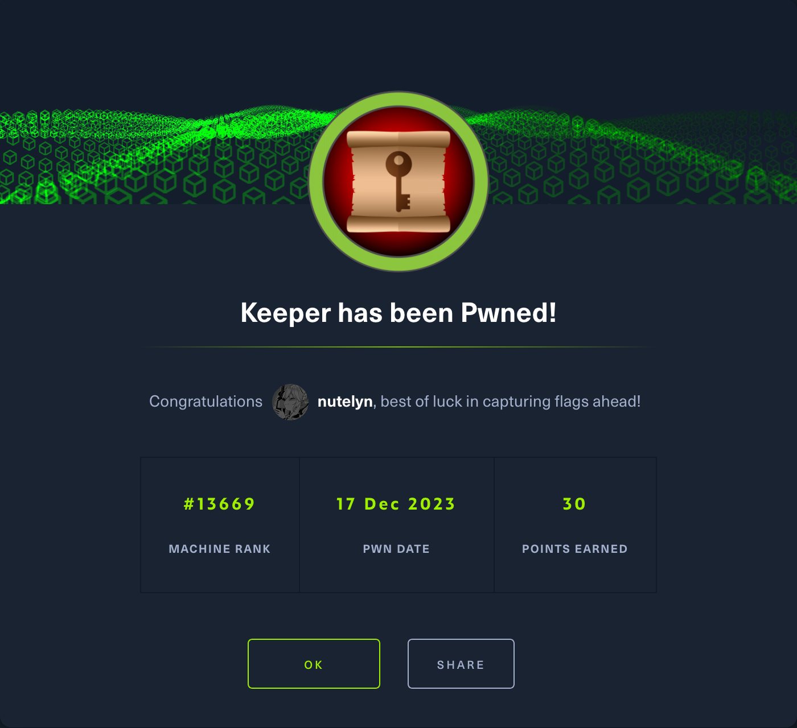

# Initial Reconnaissance
1. `curl -I 10.10.11.227` to find possible location / DNS name
2. no result found, tried using default `curl 10.10.11.227`, and return a result of redirecting into `tickets.keeper.htb` a ticket subdomain, with `keeper.htb` as the subdomain, add both to `/etc/hosts`
3. visiting the `keeper.htb` gives a link to `tickets.keeper.htb` which is a login page of `Request Tracker` by BEST PRACTICAL with the version `4.4.4+dfsg-2ubuntu1`
4. there's a cookie which doesn't look like doing anything, not even for CSRF and using common credentials such as `admin:admin` doesn't return anything
5. finding CVE doesn't return something promising, tried to find a built-in credentials from the official documentation `https://docs.bestpractical.com/rt/4.4.4/README.html` which is `root:password`
6. and i logged in successfully, looks like there's a recent tickets about `Keepass` this should have something to do with later challenge, and theres a user named `Lise Nørgaard` looking at her profile i notice there's a note saying about her account is a new account and the password is set to `Welcome2023!`, `lnorgaard` should be her username
7. nothing more interesting to be see here

# User Escalation
1. from the collected credentials, tried to connect to the machine via ssh `ssh lnorgaard@keeper.htb` if there's a prompt just `yes`, then input the password
2. once inside i did `ls` and 2 files pops up `RT30000.zip` and `user.txt`
3. `cat user.txt`
4. flag: `4d165c8407558b61f43bb5eb60cf053b`

# Further Reconnaissance
1. `sudo -l` no sudo available
2. checking `/bin` and `/usr/local/bin` for any exploitable binary, and found none
3. this `RT30000.zip` file take my interest, move it to my local machine
4. unipping this file give 2 files `KeePassDumpFull.dmp` and `passcodes.kbdx`
5. analyzing the file of course that this is a keepass file, and theres a recently discovered a CVE (CVE-2023-32784) where it allow the extraction of master password, POC `https://github.com/vdohney/keepass-password-dumper`
6. find an online opener for this .dmp, found one `https://app.keeweb.info/`
7. opening the `passcodes.kbdx` actually needs a password, which should be retrieved from `KeePassDump.dmp`
8. i see nothing more interesting

# Privilege Escalation
1. download the POC file from the github above
2. extract the master password with the POC file (make sure that the terminal is inside the repository dir and dotnet is installed), with this command `dotnet run dump_file`
3. after a while, the program returns a possible password of ``●{ø, Ï, ,, l, `, -, ', ], §, A, I, :, =, _, c, M}dgrød med fløde``
4. searching for `dgrød med fløde` return a `rødgrød med fløde` it's the password for the `passcodes.kbdx`, enter the password in the previous web which i open that file.
5. the content of the files is a PuTTY key, copy the content into `id_rsa.ppk` then use `puttygen` to generate the ssh key with `puttygen -O id_rsa.ppk private-openssh -o id_rsa`
6. then connect as root with the generated key `ssh -i id_rsa root@keeper.htb`, i have successfully logged in as root
7. `cat root.txt`
8. flag: `33a76dd7ef34f10e25cb22657ae6b529`

